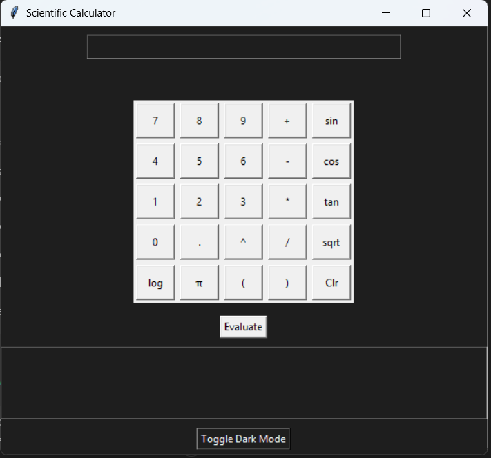
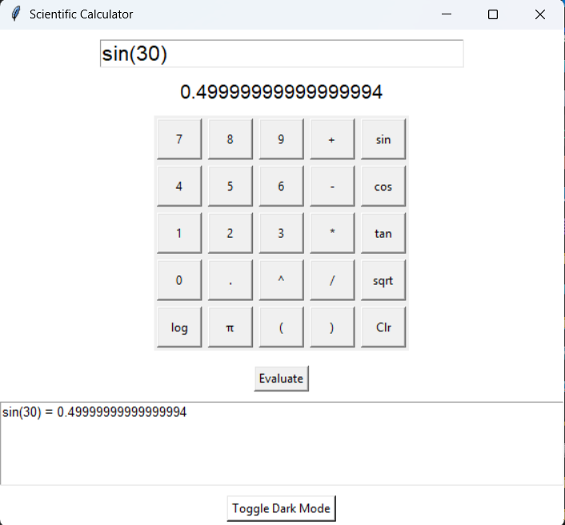
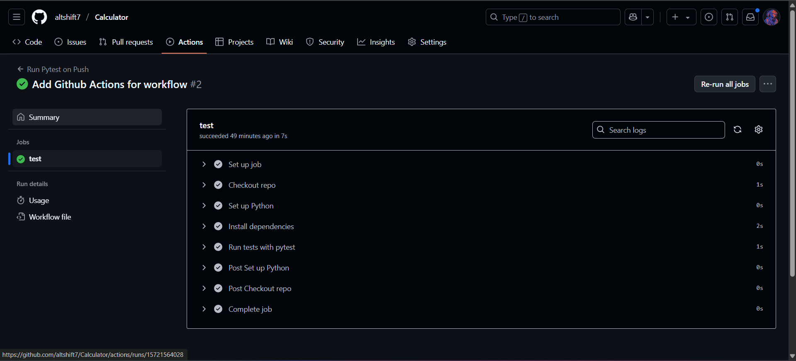

#  Scientific Calculator (Python + Tkinter + Pytest + CI/CD)

A fully-featured, modern Scientific Calculator built using **Python**, with a responsive **Tkinter GUI**, real-time expression preview, dark mode, output history panel, and automated testing using **Pytest** and **GitHub Actions CI/CD**.

---

## Features

- Basic Arithmetic Operations  
-  Trigonometric Functions (`sin`, `cos`, `tan`)  
-  Logarithm & Square Root  
-  Permutations & Combinations  
-  Number Conversions (`dec`, `bin`, `hex`)  
-  Vector Math: Dot Product, Cross Product, Magnitude  
-  **Dark Mode Toggle**  
-  **Live Expression Preview**  
-  Output History (saved in `.txt`) 
-  Unit Testing with **Pytest**  
-  **Pytest** Unit Tests  
-  **CI/CD with GitHub Actions**  
-  Test Coverage using `coverage.py`

---

##  Screenshots

###  Dark Mode Interface  


###  Expression Evaluation  


###  GitHub Actions CI  



---

##  Running Tests

```bash
python -m pytest
